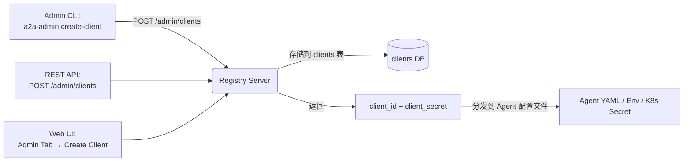

# A2A v1.0 Agent Card 标准化 + OAuth 2.1 认证集成设计

## 1. 背景与目标

当前 Simple A2A Registry 的 Agent Card 模型基于早期的 A2A draft 实现，与 A2A v1.0 正式规范存在显著差距。同时，A2A v1.0 将安全层（SecurityScheme）作为 Agent Card 的一等公民纳入规范，要求系统支持标准化的认证流程。

**目标：**
1. 将 Agent Card 数据结构完全对齐 A2A v1.0 protobuf 规范（a2a.proto）
2. 实现 OAuth 2.1 认证中间件，保护 Registry API 和 Agent 通信
3. 将 OAuth SecurityScheme 集成到 Agent Card 的 discovery 和协商流程中

## 2. 变更范围

| 模块 | 变更类型 | 说明 |
|------|---------|------|
| `models.py` — AgentCard | 重构 | 字段完全重写对齐 v1.0 spec |
| `models.py` — 安全模型 | 新增 | SecurityScheme 体系（5 种 scheme） |
| `server.py` — HTTP Server | 新增 | OAuth 2.1 Token 端点 + 认证中间件 |
| `server.py` — Registry API | 修改 | Registry 端点集成认证 |
| `store.py` — Card 持久化 | 修改 | 新数据结构适配 |
| `examples/a2a_coder_agent.py` | 修改 | 新 Card 格式 + 认证流程 |
| `tests/test_models.py` | 修改 | 新模型的序列化/反序列化测试 |

## 3. Agent Card v1.0 数据结构

### 当前字段 vs A2A v1.0 规范

| 当前字段 | v1.0 字段 | 变更说明 |
|---------|-----------|---------|
| `id` | — | 移除，agent 通过 URL 标识 |
| `name` | `name` (REQUIRED) | 保留 |
| `description` | `description` (REQUIRED) | 保留 |
| `url` | `supported_interfaces` (REQUIRED) | 替换为列表，支持多个接口 |
| `version` | `version` (REQUIRED) | 保留 |
| `capabilities.skills` | `skills` (REQUIRED) | 提升到顶级字段 |
| `capabilities` | `capabilities` (REQUIRED) | 重构为 `streaming`/`pushNotifications`/`stateTransitionHistory` |
| `provider` | `provider` | 字段对齐，`organization` → `name` |
| `authentication` | `security_schemes` + `security_requirements` | 完全重写 |
| `notification` | — | 移除（通过 capabilities.pushNotifications 表达） |
| `tags` | — | 移除 |
| `metadata` | — | 移除 |
| — | `documentation_url` | 新增 |
| — | `default_input_modes` (REQUIRED) | 新增，如 `["text/plain"]` |
| — | `default_output_modes` (REQUIRED) | 新增，如 `["text/plain"]` |
| — | `signatures` | 新增，AgentCard JWS 签名 |
| — | `icon_url` | 新增 |

### 目标 AgentCard 模型

```python
@dataclass
class AgentCard:
    name: str                              # REQUIRED
    description: str                       # REQUIRED
    supported_interfaces: List[AgentInterface]  # REQUIRED
    provider: Optional[AgentProvider]
    version: str                           # REQUIRED
    documentation_url: Optional[str]
    capabilities: AgentCapabilities        # REQUIRED
    security_schemes: Dict[str, SecurityScheme]
    security_requirements: List[SecurityRequirement]
    default_input_modes: List[str]         # REQUIRED
    default_output_modes: List[str]        # REQUIRED
    skills: List[AgentSkill]               # REQUIRED
    signatures: List[AgentCardSignature]
    icon_url: Optional[str]
```

### 关键嵌套类型

```python
@dataclass
class AgentInterface:
    url: str          # REQUIRED, absolute HTTPS
    type: str         # e.g. "a2a", "grpc", "rest"

@dataclass
class AgentCapabilities:
    streaming: Optional[bool]               # 是否支持 streaming
    push_notifications: Optional[bool]       # 是否支持 push notification
    state_transition_history: Optional[bool]  # 是否支持状态历史

@dataclass
class AgentSkill:
    id: str            # REQUIRED
    name: str          # REQUIRED
    description: str
    version: str
    tags: Optional[List[str]]
    examples: Optional[List[str]]
    input_modes: Optional[List[str]]
    output_modes: Optional[List[str]]

@dataclass
class SecurityScheme:
    # oneof: api_key / http_auth / oauth2 / open_id_connect / mtls
    description: Optional[str]
    scheme_type: str            # "apiKey" | "http" | "oauth2" | "openIdConnect" | "mutualTls"
    # Per-type fields filled based on scheme_type
    api_key: Optional[APIKeySecurityScheme]
    http_auth: Optional[HTTPAuthSecurityScheme]
    oauth2: Optional[OAuth2SecurityScheme]
    open_id_connect: Optional[OpenIdConnectSecurityScheme]
    mtls: Optional[MutualTlsSecurityScheme]

@dataclass
class OAuth2SecurityScheme:
    description: Optional[str]
    flows: OAuthFlows           # REQUIRED
    oauth2_metadata_url: Optional[str]  # RFC 8414

@dataclass
class OAuthFlows:
    authorization_code: Optional[AuthorizationCodeOAuthFlow]
    client_credentials: Optional[ClientCredentialsOAuthFlow]
    device_code: Optional[DeviceCodeOAuthFlow]
```

## 4. OAuth 2.1 认证实现方案

### 4.1 设计原则

- OAuth 2.1 ≠ OAuth 2.0，移除了 Implicit 和 Resource Owner Password Credentials Grant
- 支持 Authorization Code + PKCE（面向用户 Agent）
- 支持 Client Credentials（面向服务间通信）
- Bearer Token 使用 JWT 格式，RS256 签名
- 认证中间件使用 aiohttp middleware 机制

### 4.2 Token Endpoint

```
POST /auth/token
Content-Type: application/x-www-form-urlencoded

grant_type=client_credentials
&client_id=agent-1
&client_secret=***
&scope=task:read task:write
```

Response:
```json
{
  "access_token": "eyJhbG...NiIs...",
  "token_type": "Bearer",
  "expires_in": 3600,
  "scope": "task:read task:write"
}
```

### 4.3 JWT Token 结构

```json
{
  "iss": "simple-a2a-registry",
  "sub": "agent-1",
  "aud": ["simple-a2a-registry", "agent-2"],
  "exp": 1712345678,
  "iat": 1712342078,
  "scope": "task:read task:write"
}
```

### 4.4 认证中间件工作流

```
Request → AuthMiddleware
  ├── /auth/* → 跳过认证（Token 端点公开）
  ├── /.well-known/* → 跳过认证（Discovery 端点公开）
  ├── Authorization: Bearer *** → 验证 JWT → 注入 request['agent_id']
  ├── 无 Token → 401 Unauthorized
  └── Token 无效/过期 → 401 + WWW-Authenticate header
```

### 4.5 持久化存储

- `clients` 表：`client_id`, `client_secret_hash`, `allowed_scopes`
- `tokens` 表：`jti`, `client_id`, `scope`, `expires_at`
- 生产环境建议使用 RS256 公/私钥对（registry 启动时生成或从配置加载）

## 5. 安全集成流程

### 5.1 Agent 注册时的安全协商（方案C）

**方案C 核心变更**：Operator 通过 Admin CLI/API/Web UI 预创建 OAuth client 凭据，分发到 Agent 配置文件。Agent 不再在注册时自动获取 client_id/secret。

```
1. [Operator 预创建阶段]
   Operator → Admin CLI: a2a-admin create-client --name agent-1 --scopes "task:* agent:register"
  或
   Operator → Web UI: Admin Tab → Create Client Form
    └── Registry 生成 client_id/client_secret，写入 clients 表
       ↓
   Operator 将 client_id/client_secret 嵌入 Agent 配置文件（YAML/环境变量/挂载 Secret）

2. [Agent 启动 & 认证阶段]
   Agent 启动 → 从配置文件读取 client_id/client_secret
   Agent → Registry: POST /auth/token (grant_type=client_credentials)
    └── Registry 验证 credentials → 返回 access_token (JWT)

3. [Agent 注册（受保护端点）]
   Agent → Registry: POST /v2/agents (Authorization: Bearer <token>, AgentCard)
    └── Registry 验证 JWT + scope → 写入 AgentCard → 返回 201 Created

4. [Agent 发现]
   Agent → Registry: GET /.well-known/agent-card.json (公开端点)
    └── 获取其他 Agent 的 AgentCard → 知道对方的 security_schemes

5. [Agent 间通信]
   Agent A → Agent B: Bearer token → A2A 接口调用
```

### 5.2 Scopes 设计

| Scope | 描述 |
|-------|------|
| `task:read` | 读取任务列表和详情 |
| `task:write` | 创建和修改任务 |
| `agent:read` | 读取 Agent 列表和详情 |
| `agent:register` | 注册新 Agent |
| `agent:admin` | 管理 Agent（删除/禁用） |
| `registry:admin` | Registry 管理操作 |

## 6. 向下兼容策略

1. **现有 API**（无认证的旧端点）保留 `/v1/agents` 和 `/v2/tasks`
2. **认证端点多**新增 `/auth/*` 和认证后的端点
3. **配置开关**：`--auth-enabled false` 可禁用认证（开发/测试模式）
4. **预创建凭据**：Operator 通过 Admin CLI/API 为每个 Agent 预创建 client credentials，通过配置文件分发。不再需要 bootstrap agent 自举，方案C 已替代原自举方案。

## 7. 实现计划（工作分解）

### Phase 1: Agent Card 模型重构

- 重写 `models.py`：AgentCard、AgentSkill、AgentCapabilities、SecurityScheme 等
- 更新 `_dict_to_agent_card` 和 `_dataclass_to_dict` 序列化逻辑
- 更新 `make_agent_card` 工厂函数
- 更新 `store.py` 中 AgentCard 的序列化/反序列化
- 更新 `server.py` 中 `/.well-known/agent-card.json` 端点
- 更新 `a2a_coder_agent.py` 中的 `build_agent_card()`
- 更新所有单元测试

### Phase 2: OAuth 2.1 认证中间件

- JWT 工具函数（签发、验证）
- Token 端点 handler（`POST /auth/token`）
- auth middleware（aiohttp middleware）
- Clients 和 Tokens 的数据存储
- Scopes 验证装饰器

### Phase 3: 安全集成

- Registry 端：Token 认证 + Scope 检查
- Agent 端：从 Registry 获取 Token → Bearer header 调用 API
- Agent Card 的 security_schemes ↔ OAuth 认证联动

### Phase 4: 测试

- 单元测试：新模型序列化、JWT 签发/验证、auth middleware
- 集成测试：Token 获取 → 认证请求 → 401 拒绝
- E2E 测试：Agent 注册 → 获取 Token → 创建任务

## 8. 风险与注意事项

1. **JWT 密钥管理**：目前使用 HMAC 对称密钥，生产环境应使用 RS256 非对称密钥对
2. **Token 撤销**：暂不实现 token revocation endpoint（可通过短过期时间缓解）
3. **中间件兼容性**：auth middleware 必须正确处理 WebSocket upgrade 请求（WS 不支持 Bearer header，需用查询参数）
4. **Agent 重连**：Token 过期后 Agent 需要重新获取 Token

---

## 附录 A — 设计评审批注（PM Review 2026-05-25）

### 审查基准
对照 [A2A v1.0 a2a.proto](https://github.com/a2aproject/A2A/blob/main/specification/a2a.proto) 逐字段检查。

---

### 🔴 BLOCKING（需修改后才能开发）

#### B1. `AgentInterface.type` 字段名与 protobuf 不匹配，缺 protocl_version

**位置**：第 73-76 行 `AgentInterface`
**现状**：
```python
@dataclass
class AgentInterface:
    url: str          # REQUIRED, absolute HTTPS
    type: str         # e.g. "a2a", "grpc", "rest"
```
**proto 定义**：
```
message AgentInterface {
  string url = 1;                # REQUIRED
  string protocol_binding = 2;   # REQUIRED (原 design 中的 type)
  string tenant = 3;             # 可选
  string protocol_version = 4;   # REQUIRED
}
```
**问题**：
1. `type` 应改名为 `protocol_binding` 以对齐 protobuf 字段名
2. 缺少 REQUIRED 字段 `protocol_version`（如 `"1.0"`）
3. 缺少可选字段 `tenant`

**建议修复**：
```python
@dataclass
class AgentInterface:
    url: str              # REQUIRED
    protocol_binding: str # REQUIRED, e.g. "JSONRPC", "GRPC", "HTTP+JSON"
    protocol_version: str # REQUIRED, e.g. "1.0"
    tenant: Optional[str] = None
```

---

#### B2. `AgentCapabilities` 字段与 protobuf 不一致

**位置**：第 78-81 行 `AgentCapabilities`
**现状**：
```python
@dataclass
class AgentCapabilities:
    streaming: Optional[bool]
    push_notifications: Optional[bool]
    state_transition_history: Optional[bool]  # ❌ 不存在于 proto
```
**proto 定义**：
```
message AgentCapabilities {
  optional bool streaming = 1;
  optional bool push_notifications = 2;
  repeated AgentExtension extensions = 3;
  optional bool extended_agent_card = 4;
}
```
**问题**：
1. `state_transition_history` 不是 protobuf 定义的字段（推测是从 A2A TaskState 误移到 Capabilities）
2. 缺少 `extensions: List[AgentExtension]`
3. 缺少 `extended_agent_card: Optional[bool]`

**建议修复**：
```python
@dataclass
class AgentCapabilities:
    streaming: Optional[bool] = None
    push_notifications: Optional[bool] = None
    extensions: Optional[List[AgentExtension]] = None
    extended_agent_card: Optional[bool] = None
```

---

#### B3. `AgentSkill` 缺少 `security_requirements`，`version` 字段不存在于 proto

**位置**：第 84-92 行 `AgentSkill`
**现状**：
```python
@dataclass
class AgentSkill:
    id: str            # REQUIRED
    name: str          # REQUIRED
    description: str
    version: str       # ❌ 不存在于 proto
    tags: Optional[List[str]]
    ...
```
**proto 定义**：
```
message AgentSkill {
  string id = 1;                     # REQUIRED
  string name = 2;                   # REQUIRED
  string description = 3;            # REQUIRED（❗ 不是 Optional）
  repeated string tags = 4;          # REQUIRED（❗ 不是 Optional）
  repeated string examples = 5;
  repeated string input_modes = 6;
  repeated string output_modes = 7;
  repeated SecurityRequirement security_requirements = 8;  # ❌ 缺失
}
```
**问题**：
1. `description` 在 proto 中是 REQUIRED，应移除 Optional 标记
2. `version` 字段不存在于 proto 的 AgentSkill 中，属于多余字段
3. `tags` 在 proto 中是 REQUIRED，应标记为 REQUIRED 而非 Optional
4. 缺少 `security_requirements: List[SecurityRequirement]`

**建议修复**：移除 `version`，`description` 和 `tags` 改为 REQUIRED，新增 `security_requirements`

---

#### B4. `AgentProvider` 字段映射说明有误

**位置**：第 37 行对照表 `provider / 字段对齐，organization → name`
**问题**：protobuf 的字段名仍是 `organization`（`message AgentProvider { string url = 1; string organization = 2; }`），不是 `name`。不要重命名字段，保持 `organization` 不变。
**建议修复**：将对照表改为 `字段对齐，保留 organization`

---

#### B5. `SecurityRequirement` dataclass 未定义

**位置**：AgentCard 和 AgentSkill 中引用了 `List[SecurityRequirement]`，但全文没有定义该 dataclass
**proto 定义**：
```
message SecurityRequirement {
  map<string, StringList> schemes = 1;
}
```
**建议**：补充以下定义
```python
@dataclass
class SecurityRequirement:
    schemes: Dict[str, List[str]]  # scheme_name → list of required scopes
```

---

### 🟡 WARNING（建议修改，不阻断开发）

#### W1. Provider 字段映射表 documentation_url 并未提及是 optional

**位置**：第 42 行对照表
**问题**：proto 中 `documentation_url` 和 `icon_url` 都是 `optional string`，在最终的 AgentCard 模型中已正确体现为 `Optional[str]`，对照表无问题。但建议在 AgentCard 模型注释中标注所有 optional 字段，减少歧义。

---

#### W2. OAuthFlows 缺少已弃用的 implicit/password 声明

**位置**：第 113-116 行 `OAuthFlows`
**现状**：只包含 3 个流程（authorization_code, client_credentials, device_code）
**proto 定义**：
```
message OAuthFlows {
  oneof flow {
    AuthorizationCodeOAuthFlow authorization_code = 1;
    ClientCredentialsOAuthFlow client_credentials = 2;
    ImplicitOAuthFlow implicit = 3 [deprecated = true];    # 保留但 deprecated
    PasswordOAuthFlow password = 4 [deprecated = true];     # 保留但 deprecated
    DeviceCodeOAuthFlow device_code = 5;
  }
}
```
**建议**：虽然 OAuth 2.1 移除了 Implicit 和 Password，但 protobuf 中它们标记为 `deprecated = true` 而非移除。建议在 Python 实现时保留这两个 deprecated 类型并标注，保持与 proto oneof 的完整性，解析时向后兼容。

---

#### W3. Token Endpoint 中 Authorization Code + PKCE 流程无示例

**位置**：第 4.2 节
**问题**：4.1 设计原则提到支持 Authorization Code + PKCE，但 4.2 只给出了 Client Credentials 的请求示例。缺少 Authorization Code + PKCE flow 的端点/参数说明。
**建议**：补充 Authorization Code grant 的示例

---

#### W4. WebSocket 认证方案已定 → 查询参数 ?token=xxx（方案C）

**位置**：第 8 节风险 #3
**现状**："auth middleware 必须正确处理 WebSocket upgrade 请求（WS 不支持 Bearer header，需用查询参数）"
**方案决策**：已采用 **方案C — 查询参数 `?token=xxx`**。WebSocket 端点 `GET /v1/agents/{agent_id}/ws` 在 `--auth-enabled` 开启时要求 `?token=<jwt>` 查询参数。Token 的 `sub` 需匹配 agent_id、registry 服务账号、或 client 的 agent_card_id。查询参数中的 token 建议由 Agent 程序内部传递，避免进入服务器日志脱敏策略。

---

#### W5. 客户端注册的 Bootstrap 问题 → 方案C（已采纳）

**位置**：第 5.1 节（已按方案C重写）、第 6 节第 4 点，本附录

**问题**：Agent 第一次注册需要 client_id/client_secret，但注册时还没有这些凭证。第 6 节的 "bootstrap agent" 概念混淆——Registry 的服务账号与外部 Agent 注册不是一回事。

**方案评审与决策**：

| 方案 | 描述 | 评估结论 |
|------|------|---------|
| A | 注册端点 `/v1/agents` 保持公开，注册后返回 client_id/secret | ❌ 已放弃。公开注册端点引入安全风险——任何人都可注册 Agent，无法控制访问。OAuth 2.1 的核心要求是保护客户端凭据，公开注册与其设计目标矛盾 |
| B | 使用 pre-shared bootstrap token 进行初始注册 | ❌ 已放弃。bootstrap token 的分发、轮换、撤销与 client credentials 完全重叠，引入了额外的 token 管理复杂性而收益有限 |
| **C** | **Operator 预创建 client credentials，通过配置文件/Admin UI 分发给 Agent** | **✅ 已采纳。** |

**方案C 决策理由**：

1. **最小攻击面**：Agent 注册端点是受保护的 `/v1/agents`（需 `agent:register` scope），只有持有有效 JWT 的 Agent 可以注册。Operator 预创建的凭据完全在内部控制。
2. **运维与安全职责分离**：Admin（运维人员）负责凭据生命周期管理，Agent 仅使用凭据获取 Token。符合最小权限原则。
3. **与生产环境的 Share Responsibility 模型一致**：凭据管理属于 Operator 的职责范围，Agent 是"受管节点"，通过配置文件/Secrets 机制注入凭据。这与 K8s Secret、HashiCorp Vault 等基础设施标准一致。
4. **支持多通道分发**：Operator 可通过 Admin CLI、REST API、Web UI 三种方式创建和分发，适配不同运维场景。

**方案C Admin 工作流（三种通道）**：



**Admin CLI 示例**：
```bash
# 创建客户端凭据
a2a-admin create-client \
  --name "my-agent" \
  --scopes "task:read task:write agent:register" \
  --output json

# 输出
# {"client_id": "cli_abc123", "client_secret": "***", "scopes": ["task:read", "task:write", "agent:register"]}
```

> **Registry 服务账号自举**：启动时 Registry 会自动创建一个内置的 `simple-a2a-registry` 服务账号（拥有全部 6 个 scope），用于自身管理操作。可通过 `--bootstrap-secret` CLI 参数显式指定其 secret（默认自动生成并打印到日志）。此账号受保护，不能通过 Admin API 删除。

**REST API 示例**：
```bash
# 使用 Admin 凭据创建客户端
curl -X POST http://registry:8080/admin/clients \
  -H "Authorization: Bearer <admin_token>" \
  -H "Content-Type: application/json" \
  -d '{"name": "my-agent", "scopes": ["task:read", "task:write", "agent:register"]}'
```

**Web UI（Admin Tab）**：
- 功能：Client 列表查看 + 创建/查看/撤销操作
- 创建表单：Agent Name、Scopes（多选复选框）、可选描述
- 创建成功后弹窗显示 client_secret（仅显示一次，提醒保存）
- 撤销操作会立即吊销对应客户端的全部 Token

**Agent 配置分发示例**：
```yaml
# agent-config.yaml
a2a:
  registry_url: "http://registry:8080"
  auth:
    client_id: "cli_abc123"
    client_secret: "***"
    scopes: ["task:read", "task:write", "agent:register"]
```

---

### 🟢 INFO（文档澄清，无代码修改）

#### I1. 向后兼容第 1 点：/v2/tasks 归类为现有 API 易混淆

**位置**：第 6 节第 1 点
**现状**："现有 API 保留 /v1/agents 和 /v2/tasks"
**说明**：代码中 `/v2/tasks` 是 kanban 编排模块（orchestration）已有的端点，归类为 API 名称上有歧义。建议改为 "保留现有端点（不含认证）：/v1/agents 和 /v2/tasks" 以避免 v2 前缀引起误解。

---

#### I2. 持久化方案的数据库选型未指定

**位置**：第 4.5 节
**现状**：提到了 `clients` 表和 `tokens` 表，但未说明使用什么数据库
**说明**：当前 store.py 基于内存/文件 JSON。新增 SQL 表意味着引入数据库依赖。建议明确是 SQLite（内嵌）还是需要外部 DB，以及 migration 策略。

---

#### I3. AgentSkill 新增 `uri_schemes` 字段

**位置**：第 36 行（当前 models.py 已有）
**问题**：当前 `AgentSkill` 已有 `uri_schemes: List[str]` 字段用于路由，但设计文档的目标 AgentSkill 模型中未包含此字段。这是在 v0.x 中加的扩展字段，如果 v1.0 规范中没有，建议确认是否保留或迁移到 `tags` 中表达。

---

### 评审结论

| 类别 | 数量 | 处理 |
|------|------|------|
| 🔴 BLOCKING | 5 | 必须修复后方可开始开发 |
| 🟡 WARNING | 4 | 建议在开发前达成共识（W5 已通过方案C解决） |
| 🟢 INFO | 3 | 文档补充，不影响开发 |

**总体评价**：设计方向正确，AgentCard 顶层字段对齐良好，OAuth 2.1 流程合理。主要问题集中在嵌套类型（AgentInterface、AgentCapabilities、AgentSkill）的字段准确度。Bootstrap 认证流程缺口已通过方案C（Operator 预创建 client credentials）解决。建议先解决 B1-B5，再针对 W4（WebSocket 认证）决定技术方案。

—— PM Review, 2026-05-25

---

## 附录 B — 实现状态对照

| 设计项 | 实现状态 | 说明 |
|--------|---------|------|
| AgentCard 模型重构对齐 v1.0 protobuf | ✅ 已完成 | `models.py` 完全重写 |
| SecurityScheme 体系（5 种 scheme） | ✅ 已完成 | 含 APIKey/HTTP/OAuth2/OpenID/MutualTLS |
| OAuth 2.1 Token 端点 `POST /auth/token` | ✅ 已完成 | 支持 client_credentials + authorization_code |
| JWT 签发（RS256 生产 / HS256 开发） | ✅ 已完成 | 启动时自动生成 RSA 密钥对 |
| Auth 认证中间件 | ✅ 已完成 | aiohttp middleware，Scope 校验 |
| Admin 客户端管理（/admin/clients） | ✅ 已完成 | CLI + REST API + Web UI 三种通道 |
| WebSocket 认证（?token=xxx） | ✅ 已完成 | 查询参数传递 JWT，sub 匹配 agent_id / client |
| 统一 SQLite Store | ✅ 已完成 | 4 表 (agents/oauth_clients/oauth_tokens/auth_codes)，自动 JSON 迁移 |
| `--bootstrap-secret` CLI 参数 | ✅ 已完成 | 指定 Registry 服务账号 secret，不传则自动生成 |
| Admin Web UI | ✅ 已完成 | OAuth 客户端管理 + Kanban 看板增强 |
| A2A Coder Agent 示例 | ✅ 已完成 | `examples/a2a_coder_agent.py`，完整 A2A 协议兼容 |
| Authorization Code + PKCE flow | ✅ 已完成 | store.py 含 auth_codes 表 + PKCE S256 验证 |
| Implicit/Password 废弃流程保留 | ✅ 已完成 | OAuthFlows 已标注 deprecated 字段 |
| Token revocation endpoint | ❌ 未实现 | 通过短过期时间（3600s）缓解；Admin 删除 client 时自动吊销其所有 token |